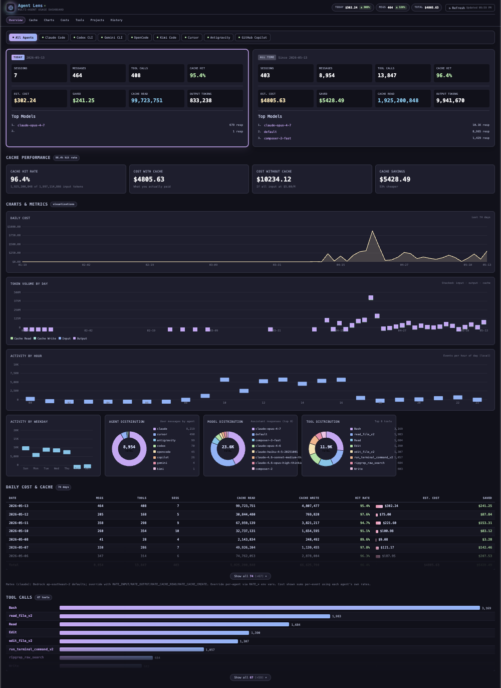

# agent-lens

Local dashboard for visualizing usage across **eight AI coding agents** — sessions, token costs, cache performance, tool calls, and daily breakdowns. Filter by agent or view everything in one place.

> Inspired by [foyzulkarim/claude-lens](https://github.com/foyzulkarim/claude-lens).



## Supported agents

| Agent | Default data path | Token data | Tool calls | Models |
|-------|-------------------|------------|------------|--------|
| **Claude Code** | `~/.claude` | full | full | yes |
| **Codex CLI** | `~/.codex` | full | full | yes |
| **Gemini CLI** | `~/.gemini` | full | full | yes |
| **OpenCode** | `~/.local/share/opencode` | full (SQLite) | full | yes |
| **Kimi Code** | `~/.kimi` | partial (TurnBegin events) | partial | partial |
| **Cursor** | `~/Library/Application Support/Cursor/...` (auto-detected per OS) | full (SQLite `cursorDiskKV`) | full | partial |
| **Antigravity** | `~/.gemini/antigravity` | session metadata only (protobuf) | — | — |
| **GitHub Copilot** | VS Code `User/workspaceStorage/<hash>/chatSessions/*.{json,jsonl}` (auto-detected per OS) | session metadata + prompts (no token counts in chat JSON) | full | yes |

OpenCode and Cursor read SQLite via the optional `better-sqlite3` dependency. If the prebuild fails on your platform the dashboard still works for the JSONL/JSON-based agents (Claude, Codex, Gemini, Kimi, Antigravity).

## Features

- **Agent selector** — filter the entire dashboard by agent or aggregate across all
- **Today vs All-Time stats** — sessions, messages, tool calls, estimated cost
- **Cache performance** — hit rate, savings vs no-cache baseline (uses the active agent's pricing)
- **Daily cost & cache table** — per-day token breakdown with estimated spend
- **Tool call analytics** — which tools each agent used most
- **Per-agent pricing** — independent rate config per provider via `.env`

## Requirements

- Node.js 18+
- One or more of the supported agents installed locally
- Works on **macOS, Linux, and Windows**. Default data directories are auto-detected per OS.

### Platform support

The dashboard runs on macOS, Linux, and Windows. Path resolution per agent:

- **Verified**: macOS — actively tested against real installs.
- **By convention**: Linux/Windows — adapters use `os.homedir()` + the agent's documented dotfile, or the standard Electron `app.getPath('userData')` location for IDE-style agents (Cursor, Copilot via VS Code, Antigravity). These match each agent's published behavior; report mismatches via issue with the actual path your install uses.
- **Always overridable**: every adapter accepts an env var to point at any path you want.

### Platform-specific defaults

| Agent | macOS | Linux | Windows |
|-------|-------|-------|---------|
| Claude | `~/.claude` | `~/.claude` | `%USERPROFILE%\.claude` |
| Codex | `~/.codex` | `~/.codex` | `%USERPROFILE%\.codex` |
| Gemini | `~/.gemini` | `~/.gemini` | `%USERPROFILE%\.gemini` |
| OpenCode | `~/.local/share/opencode` | `$XDG_DATA_HOME/opencode` or `~/.local/share/opencode` | `%LOCALAPPDATA%\opencode` → `%APPDATA%\opencode` → `~/.local/share/opencode` (first existing) |
| Kimi | `~/.kimi` | `~/.kimi` | `%USERPROFILE%\.kimi` |
| Cursor | `~/Library/Application Support/Cursor/User/globalStorage/state.vscdb` | `~/.config/Cursor/User/globalStorage/state.vscdb` | `%APPDATA%\Cursor\User\globalStorage\state.vscdb` |
| Antigravity | `~/.gemini/antigravity` | `~/.gemini/antigravity` | `%USERPROFILE%\.gemini\antigravity` |
| Copilot | `~/Library/Application Support/{Code,Code - Insiders,VSCodium,Cursor}/User` | `~/.config/{Code,Code - Insiders,VSCodium,Cursor}/User` | `%APPDATA%\{Code,Code - Insiders,VSCodium,Cursor}\User` |

Override any of these with `CLAUDE_DIR`, `CODEX_DIR`, `GEMINI_DIR`, `OPENCODE_DIR`, `KIMI_DIR`, `CURSOR_DIR` (or `CURSOR_DB` for a specific `.vscdb` file), `ANTIGRAVITY_DIR`, `COPILOT_DIR` / `COPILOT_VSCODE_ROOT`.

## Quick start

No install needed — run directly from GitHub:

```bash
npx github:naimjeem/agent-lens
```

Then open [http://localhost:3456](http://localhost:3456). The dashboard auto-detects which agents have data on your machine and disables tabs for the rest.

## Local setup

```bash
git clone https://github.com/naimjeem/agent-lens.git
cd agent-lens
npm install
cp .env.example .env
```

Edit `.env` to override data directories or pricing. All paths default to standard locations — usually no edits needed.

```bash
node server.js
```

Open [http://localhost:3456](http://localhost:3456).

## Configuration

### Data directories

| Variable | Default |
|----------|---------|
| `CLAUDE_DIR` | `~/.claude` |
| `CODEX_DIR` | `~/.codex` |
| `GEMINI_DIR` | `~/.gemini` |
| `OPENCODE_DIR` | `~/.local/share/opencode` |
| `KIMI_DIR` | `~/.kimi` |
| `CURSOR_DB` / `CURSOR_DIR` | macOS: `~/Library/Application Support/Cursor/User/globalStorage/state.vscdb` · Linux: `~/.config/Cursor/User/globalStorage/state.vscdb` · Windows: `%APPDATA%/Cursor/User/globalStorage/state.vscdb` |
| `ANTIGRAVITY_DIR` | `~/.gemini/antigravity` |

### Pricing (USD per 1M tokens)

Each agent has its own rate set. Defaults are sensible approximations; override per-agent:

| Variable prefix | Default input | Default output | Default cache read | Default cache write |
|-----------------|---------------|----------------|--------------------|---------------------|
| `RATE_*` (Claude) | 5.0 | 25.0 | 0.5 | 6.25 |
| `RATE_CODEX_*` | 1.25 | 10.0 | 0.125 | 0 |
| `RATE_GEMINI_*` | 1.25 | 10.0 | 0.31 | 0 |
| `RATE_OPENCODE_*` | 3.0 | 15.0 | 0.3 | 3.75 |
| `RATE_KIMI_*` | 0.55 | 2.20 | 0.15 | 0 |
| `RATE_CURSOR_*` | 0 | 0 | 0 | 0 |
| `RATE_ANTIGRAVITY_*` | 0 | 0 | 0 | 0 |
| `RATE_COPILOT_*` | 0 | 0 | 0 | 0 |

Each prefix has four suffixes: `_INPUT`, `_OUTPUT`, `_CACHE_READ`, `_CACHE_CREATE`.

Default Claude rates match **Bedrock cross-region inference (ap-southeast-2)**. For Anthropic API rates use `RATE_INPUT=15`, `RATE_OUTPUT=75`, `RATE_CACHE_READ=1.5`, `RATE_CACHE_CREATE=18.75`.

OpenCode also reports actual `cost` per assistant message in its DB; that value is preferred over the rate calculation when present.

## Notes per agent

- **Cursor** stores chat history in `state.vscdb` under `Application Support/Cursor/User/globalStorage` (macOS), `~/.config/Cursor/...` (Linux), or `%APPDATA%/Cursor/...` (Windows). The dashboard reads the `cursorDiskKV` table directly: prompts, per-bubble token counts, tool calls (`toolFormerData`), and per-session model name from `composerData`. Override via `CURSOR_DB` (full path to `state.vscdb`) or `CURSOR_DIR` (directory containing it). Default rates are 0 because most Cursor users pay a flat subscription rather than per token; set `RATE_CURSOR_*` to estimate spend.
- **Antigravity** writes conversations as binary protobuf (`*.pb`) in `~/.gemini/antigravity/conversations`. Without the `.proto` schema the dashboard reports session count and timestamps only.
- **Kimi** logs are sparse in the local `wire.jsonl` — turn boundaries and user inputs are reliable; token counts depend on whether your Kimi version emits `TokenUsage`/`Usage` events.
- **GitHub Copilot** chat sessions live under VS Code's `User/workspaceStorage/<hash>/chatSessions/*.{json,jsonl}`. The dashboard reads request prompts, response tool invocations, and the per-session model from `inputState.selectedModel.metadata.name`. Token counts are **not** stored in these files (Copilot bills via subscription server-side), so per-message tokens display as 0; messages, sessions, and tool calls are accurate. Adapter scans `Code`, `Code - Insiders`, `VSCodium`, and `Cursor` flavors. Override with `COPILOT_DIR` (a single `User/` dir) or `COPILOT_VSCODE_ROOT`.

## Author

Maintained by [naimjeem](https://github.com/naimjeem) — &lt;[naimjeem.me](https://naimjeem.me/)&gt;.
